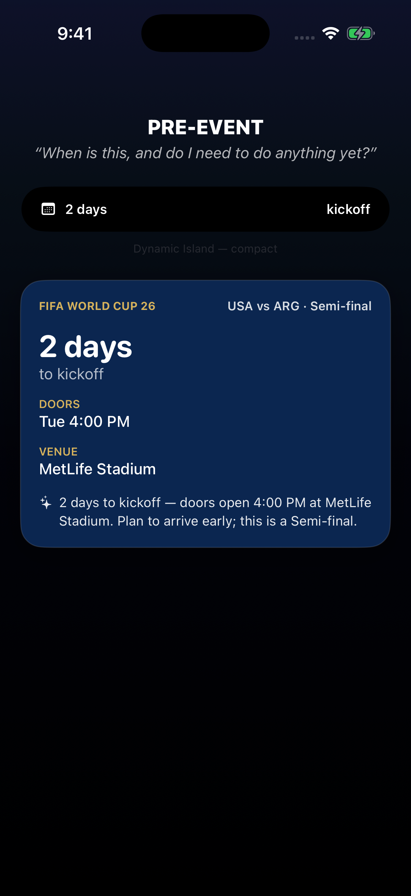
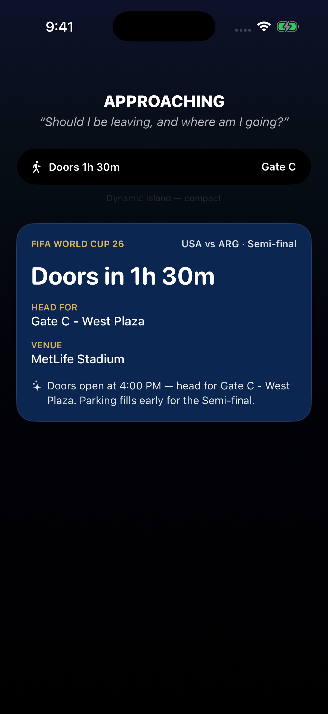
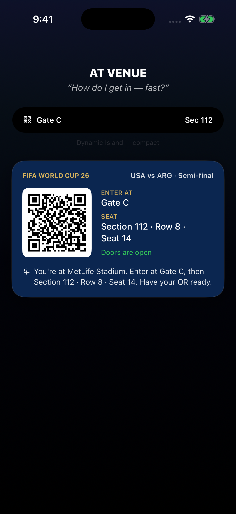
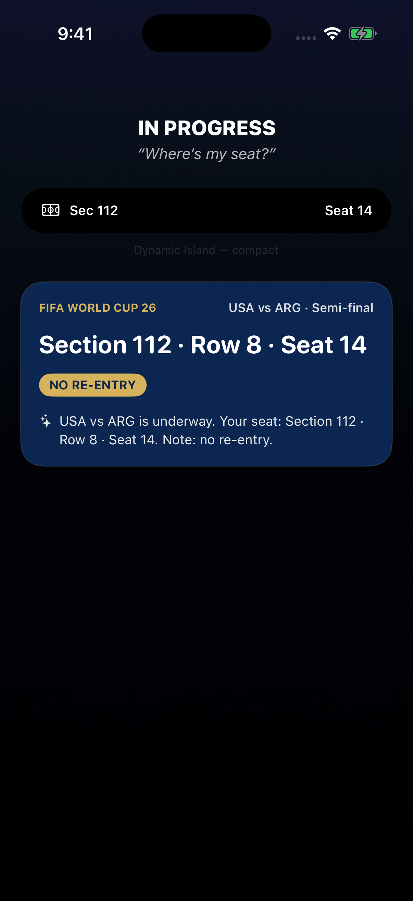
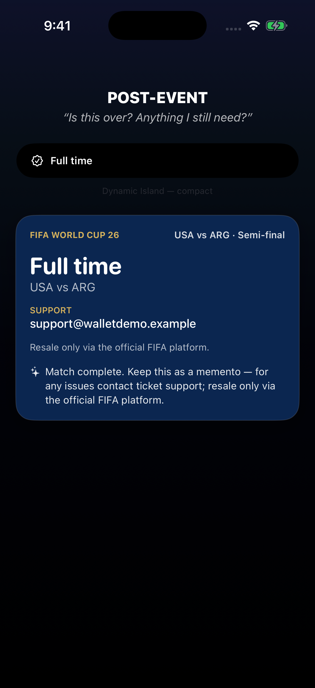
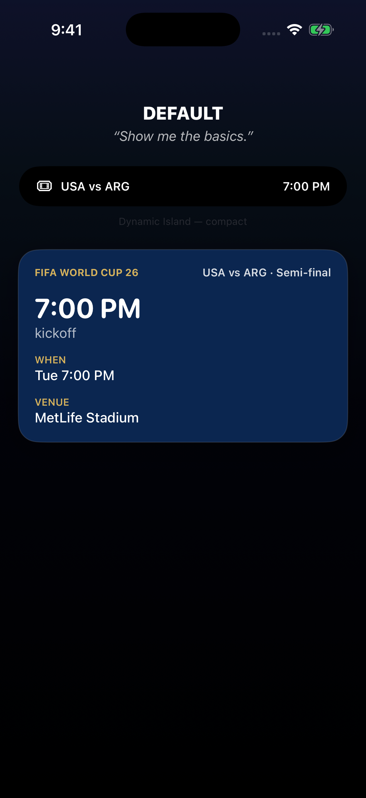

# Anticipatory Ticket Live Activity

**One line:** A World Cup ticket's key info is static and buried until you go digging — so this feature surfaces the *one fact you need right now* (countdown → directions → entry QR → seat → wrap-up) on a phase-aware Live Activity card, driven entirely by time-to-kickoff and venue proximity.

---

## How it works

`pass.json` is unchanged — the same ~15 facts the whole time. A pure **`JourneyPhase` engine**
(`Sources/JourneyPhase.swift`) maps `(now, at-venue, doors, kickoff)` to one of six phases, and
the shared Live Activity surfaces (`Sources/LiveActivitySurfaces.swift`) lead with whatever that
phase needs. A **`Summarizer`** adds one natural-language line on top (template today, Apple
FoundationModels later — see [`prd.md`](prd.md)).

Every screenshot below is captured headlessly from a **mocked clock**: `demo-shots.sh` launches
the app once per phase with `-DemoNow <date>` / `-DemoAtVenue <bool>`, so the real engine
computes the phase and the harness renders the exact surfaces a widget extension would show.

```bash
./demo-shots.sh          # build once → screenshot every use case into docs/
```

> Scope note: the on-device ActivityKit registration (real Lock Screen / Dynamic Island
> surfacing via a widget extension + a live `CLMonitor` geofence) is the documented
> **device-only** step — `simctl` can't reach the Lock Screen headlessly. The harness renders
> the *identical* SwiftUI surfaces so every use case is verifiable on the Simulator. See
> [`prd.md` → Implementation status](prd.md) and [`usecase.md`](usecase.md).

---

## The use cases

The journey, USA vs Argentina, FIFA World Cup 2026 Semi-final · MetLife Stadium · Gate C ·
Section 112, Row 8, Seat 14 · doors 4:00 PM, kickoff 7:00 PM ET.

### 1. Pre-event — *"When is this, and do I need to do anything yet?"*



Mocked to **2 days out**. Leads with the **countdown to kickoff** and **doors / venue** —
orientation, not detail. No QR, no seat clutter. *Solves:* the glance-to-reassure moment with
the date and place, nothing else.

### 2. Approaching — *"Should I be leaving, and where am I going?"*



Mocked to **match-day 2:30 PM** (inside the travel window). The countdown flips to **"Doors in
1h 30m"** and leads with the **entrance (Gate C – West Plaza)**. Seat is suppressed — useless on
the highway. *Solves:* the logistics decision — when to leave and which gate.

### 3. At venue — *"How do I get in — fast?"*



Mocked to **4:30 PM with the at-venue signal set**. The **QR becomes the hero**, beside **Gate C
→ Section 112 · Row 8 · Seat 14**. This is the sharpest beat: the QR is *absent* in every other
phase and appears only here. *Solves:* the scan-and-find-my-seat moment in a moving crowd.

### 4. In progress — *"Where's my seat?"*



Mocked to **8:00 PM** (after kickoff). Calm and minimal: just the **seat line** and a **NO
RE-ENTRY** reminder. Countdown and directions are gone. *Solves:* the steward-check / back-from-
the-concourse glance without noise.

### 5. Post-event — *"Is this over? Anything I still need?"*



Mocked to **11:00 PM** (after the final whistle). Leads with **"Full time"**, closure, and the one
remaining actionable thing — **ticket support + official resale**. Gate/seat/QR all demoted.
*Solves:* the wrap-up, then the activity ends and clears the pill.

### 6. Default — *"Show me the basics."*



The `unknown` fallback (mocked clock = `none`). When the engine can't confidently place the user,
it shows a **neutral kickoff card** — match, time, venue — and **no narrated line**. *Solves:*
graceful degradation: worst case is a neutral card, never a wrong lead.

---

## Content per phase

What leads (●●●) / supports (●●○) / recedes (○○○) — the rules `PhasePresentation` encodes:

| Content | preEvent | approaching | atVenue | inProgress | postEvent |
|---|---|---|---|---|---|
| QR code | ○○○ | ○○○ | ●●● | ●●○ | ○○○ |
| Date / countdown | ●●● | ●●● | ○○○ | ○○○ | ○○○ |
| Gate / entrance | ●●○ | ●●● | ●●● | ●●○ | ○○○ |
| Seat | ●●○ | ○○○ | ●●● | ●●● | ○○○ |
| Support / resale | ○○○ | ○○○ | ○○○ | ○○○ | ●●● |

See [`usecase.md`](usecase.md) for the full per-phase breakdown and [`prd.md`](prd.md) for the
architecture, the Siri-vs-FoundationModels research, and the device-only follow-ups.
